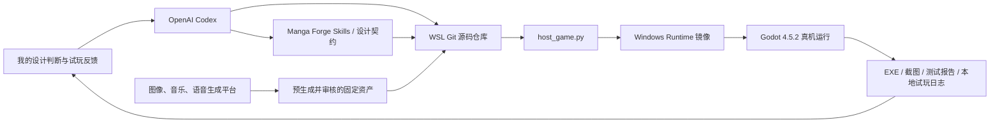

# 五天、20 次提交、一个能跑的漫画像素 Roguelike：我如何和 AI 做出《墨卫残章》

> 作者：Joyer Huang｜AI 开发协作者：OpenAI Codex（GPT-5）
>
> 项目：**Last Inkwarden / 墨卫残章**
>
> 当前阶段：`0.25.0-beta.1`，准备通过 itch.io 与夸克网盘公开分发的免费 Windows Beta

如果只看最终截图，很容易把“用 AI 做游戏”理解成：输入一段提示词，等它吐出几张图和一份代码，然后点击运行。

我的实际经历几乎完全相反。

这几天，我和 OpenAI Codex 围绕 Manga Forge 做了一次端到端实验：先补齐漫画风格游戏开发所需的 Agent/Skill 和本地工具链，再用 Godot 做出一款真正可以在 Windows 上运行、支持手柄、存档、中文、剧情、成长和试玩记录的 2D 漫画像素动作 Roguelike。它最初叫 Inkbound Rogue，几次讨论后最终定名为 **Last Inkwarden / 墨卫残章**。

做出一款游戏是目标之一，另一个同样重要的动机，是把足够复杂的真实项目当作试验场，检验 **AI Agent 的能力边界**：它能否不止回答问题和生成片段，而是在连续多日、需求不断变化、源码和资产相互依赖的情况下，把工作真正推进到可运行、可回归、可交付的状态？

从 2026 年 9 月 1 日第一个游戏提交到 9 月 5 日，Git 主线记录了 20 次相关提交。到写下本文时，项目已有 24 个运行时 GDScript、45 个测试脚本，脚本与测试合计约 2.48 万行；资源清单覆盖 113 个玩家可见的 PNG、WAV 和 OGG 文件。最新 Windows 候选构建约 127 MB，并通过了一套串行的 31 项 P1 自动化门禁。

但我想先把结论说在前面：

**AI 极大提高了把想法变成可运行系统的速度，却没有取消产品判断、审美选择、真人试玩、版权核验和发布责任。**

这篇文章记录的重点，也不是“AI 一键生成了一个游戏”，而是我怎样把 AI 放进一个持续迭代、可以验证、能够追责的生产流程里。

## 最后做出了什么

《墨卫残章》是一款俯视角、漫画像素风的 2D 武器砍杀 Roguelike。主角 Nara 是最后的墨卫，她进入一部会自我改写的活体手稿，在十二个逐渐升级的页章中对抗被历史抹去后形成的面具怪物。

当前版本包含：

- 三幕、十二页的完整流程，三个 Boss、七段可回看的剧情过场和两个持久结局；
- 五种武器形态及五种专属“墨术”，每种都有全屏特写、约五帧起手动作、时停和独立打击节奏；
- 36 个可叠加技巧、12 件遗物、15 类敌人、9 条区域路线、6 个挑战契约和 11 层通关后 Proof 难度；
- 局内升级、永久成长、每日挑战、图鉴、19 个预留稳定 ID 的成就；
- New Game、Continue / Load、Save & Return、自动备份和旧存档迁移；
- 键鼠与默认手柄支持，包括标题菜单、战斗、弹窗、暂停、剧情和重新绑定；
- 英文与简体中文完整界面，语言可以在运行中切换并持久保存；
- 五首 AIGC 配乐、日文墨术台词、主角受击与死亡语音、低声量敌人反馈；
- 本地匿名试玩记录器、可选的 GameAnalytics，以及不会污染正式存档的 JSON 调试启动状态。

这仍然是免费公开 Beta 候选版，不是 Steam 发布完成品。项目将通过 itch.io 和夸克网盘公开分发并征集反馈；截至开放前，唯一正式列入鸣谢的真人试玩玩家是 **Andrew Huang**。自动化测试和模拟玩家能找到大量程序、平衡与流程问题，但不能替代更多真实玩家对手感、疲劳、理解成本和情绪节奏的判断。

## 起点：我原本只是在研究一套图片工作流

最初的问题并不是“请替我做一款游戏”。我先研究了 `awesome-gpt-image-2` 是否能生产游戏 Sprite，又检查 Manga Forge 现有的本地图片和文生视频能力，想知道它们能否支撑漫画风格的 2D 游戏，偶尔兼顾 3D。

这个问题很快暴露出一个事实：有图片生成能力，不等于有游戏生产能力。

一款可玩的游戏至少还需要输入系统、角色移动、物理与碰撞、动画状态、UI、音频、关卡、存档、导出、性能检查和回归测试。于是项目先建立了一组面向 Godot 和漫画游戏的技能环境，包括 2D/3D 基础、动画、音频、UI、输入、关卡设计、Roguelike、存档、性能、剧情、视觉小说、语音、游戏手感和本地漫画资产生产等 35 个 Skill 目录。

2026 年 8 月 28 日的提交 `1193f3e`，先把这些 Agent Skill 和音频工具纳入 Git。这一步看似没有“做游戏”，实际是在搭建 AI 能长期工作的上下文：规则放在哪里、素材怎样进入项目、什么可以自动生成、什么必须回到 Windows 真机验证。

之后我才提出真正的验收任务：补足 Manga Forge 缺失的游戏开发能力，并开发一款 2D 像素风武器砍杀 Roguelike，最终必须能在 Host Windows 设备上运行，且默认支持手柄。

## 另一个动机：用完整游戏检验 AI Agent 的能力边界

我想检验的并不是模型能否在一次对话里写出角色移动脚本，也不是用几个静态题目测代码正确率。游戏恰好是一种很苛刻的综合任务：输入、物理、动画、UI、声音、资源、存档、构建和玩家感受会互相影响，一个局部看似正确的改动，经常会在另一个系统里产生回归。

因此，这个项目也在持续观察 Agent 能否做到以下几件事：

- **长期维持项目状态。** 在几十轮需求、Bug 报告、命名变化和分支提交之间，理解哪些是新要求，哪些是已经修过却不能回归的约束；
- **把自然语言变成工程约束。** 将“声音太幼稚”“弹窗手感差”“远程攻击看不清”转化为混音、动画时长、输入消费、颜色层级和弹幕预算；
- **操作真实工具而不止输出代码。** 修改仓库、同步 WSL 与 Windows、调用 Godot、生成或处理资源、构建 EXE，并读取实际运行结果；
- **建立自我校验。** 为每次修正补测试、截图或审计记录，避免用一句“已经完成”代替证据；
- **处理跨系统故障。** 区分 GDScript 问题、Windows 焦点行为、手柄输入、后台进程、音频导入、网络统计和构建凭据等不同故障层；
- **尊重权限与数据边界。** 不把密钥提交进 Git，不让调试配置污染正式存档，不把未经同意的试玩数据上传；
- **接受人的否决。** 当代码正确但演出、声音或节奏不成立时，能够回到需求继续迭代，而不是把技术完成等同于产品完成。

几天后的观察是：Agent 在目标明确、状态被外部化、测试可运行时非常强。它可以快速处理大量相互关联的代码和文档，把一次 Bug 反馈扩展为实现、测试、构建与说明的完整修改；也很适合维护资源清单、生成重复性工具和执行漫长的回归流程。

它的边界也同样明显。Agent 不会天然知道什么叫“帅气”“沉稳”或“玩久了很累”；如果需求没有写清，往往会交付形式正确但体验错误的版本。它还可能过度并行、遗留进程、把菜单可见误判为游戏已暂停，或者在局部修复中制造新的状态问题。长对话能保存目标，却不能免除 Git、设计文档、测试报告和人工复核这些外部记忆。

所以，这不是一场“AI 能否独立做游戏”的表演，而是一场更实际的检验：**人在给出方向、审美与责任边界之后，Agent 能否持续完成跨工具、跨文件、跨平台的工程闭环。**

## AI 不是一个按钮，而是流水线中的协作者

整个系统大致如下：



我在 WSL 中维护 Git 源码，Windows 的运行镜像放在独立目录。`host_game.py` 负责同步项目、调用 Windows 上的 Godot、导入资源、运行测试、截取 UI 证据和导出 EXE。这样既保留了 Linux 下适合自动化和版本管理的工作环境，也让最终判断发生在玩家真正使用的 Windows 渲染器、音频设备和手柄环境上。

常用入口被压缩成了几条命令：

```bash
python3 tools/windows/host_game.py sync
python3 tools/windows/host_game.py p1-suite
python3 tools/windows/host_game.py export
python3 tools/windows/host_game.py playtest --participant P-001
python3 tools/windows/host_game.py process-status
```

这里有一个来自真实失误的规则：**测试必须串行运行并检查残留进程。**

开发早期，我发现 delegate runner 偶尔会留下多个 Godot 或游戏实例。多开不但抢占输入和音频，还会让测试结果变得不可信。后来流水线增加了单实例启动、每项测试超时、定向清理和 `process-status` 检查。现在 P1 门禁在同一 runner 会话内串行执行，结束后必须证明 Godot 和导出的游戏进程数量为零。

## 真正推动游戏变化的，是“玩起来不对”

AI 很容易完成一个形式上正确的功能。例如“有升级菜单”“有音效”“有手柄映射”。但游戏开发最麻烦的部分恰恰是：它们存在，却不好用。

### 1. 暂停不是显示一个菜单

最早的升级 Buff 选择和 Pause 菜单虽然出现在屏幕上，战斗却仍在后台继续。修正后，升级、遗物、事件、手册、设置和暂停都进入同一套模态状态管理：游戏树暂停，必要 UI 仍可处理输入，关闭时再安全交还控制权。

随后又出现了一个更隐蔽的问题：选择 Buff 后角色偶尔完全不响应。原因不是动画，而是关闭弹窗时用“一刀切”的方式等待所有动作释放；某个丢失的 release 事件会把角色永久锁住。最终方案只封锁会与选择键重叠的攻击、冲刺和墨术，并为丢失释放事件设置 0.75 秒保险，同时允许持续按住的移动在菜单关闭后立即恢复。

这个 Bug 给我的启示是：

> 输入系统不是一组按键映射，而是一份跨越战斗、暂停、焦点变化和 UI 转场的状态契约。

### 2. 手柄支持必须从标题画面开始

“默认支持手柄”不能只指战斗时左摇杆能移动。第一位试玩者很快指出，标题菜单没有清晰的手柄游历和选择逻辑；按 B 关闭 Buff 菜单还会顺带触发墨术。

后来标题界面加入了可见的空间导航光标，暂停菜单、武器库、设置、剧情档案、成就、每日挑战和 Proof 面板都建立了确定的焦点顺序，并对关闭弹窗的输入做消费和释放隔离。游戏窗口失去焦点时会立刻暂停并拒绝键鼠、手柄和剧情输入；重新获得焦点后仍保持暂停，必须由玩家主动恢复。

这不是 Godot 的能力限制，而是应用必须明确实现的焦点与输入策略。

### 3. 读得懂比“特效很多”更重要

试玩中还发现，从第一幕后段开始远程火力过密，敌方子弹又和可拾取物颜色接近。修正不是简单降低所有敌人数值，而是：

- 为每一页设置敌方子弹预算，从前期 8 发逐步增长到后期 30 发；
- 限制早期远程兵种同时进入自然生成池；
- 敌方弹体统一为冷青色菱形，增加暗色隔离光晕与准星刻度；
- 拾取物保留暖红、象牙白和金色，并提高 `+HP`、`AOE` 的现场可读性；
- 减薄经验条、降低 HUD 和中央弹窗的遮挡感。

类似地，升级和遗物卡片一度出现文字互相覆盖。后来不只修文字位置，还为 36 个技巧和 12 件遗物补上可辨识图标，并用最长文案自动跑排版测试。

## 从“电子哔声”到有材质的战斗声音

音频是这次开发里反复推倒最多的部分之一。

第一版挥砍、拾取和 UI 音效虽然功能齐全，却被我评价为“幼稚、滑稽、像纯电子音”。这类问题无法靠“声音文件存在”来验收。后来音频规范明确要求用空气切割、纸张、木质、笔刷、刀柄和克制的金属共振构成声音身份，避免上扬琶音和扫频振荡器成为主体。

背景音乐也走过弯路。程序生成的小样只能验证播放和循环，达不到我想要的交响、混音、人声与高保真乐器质感。我让 AI 分别为菜单、战斗、剧情过场和结局写中文情绪提示词，再在海绵音乐中生成五首曲目：

- 《墨色残响》：标题与档案菜单；
- 《墨战交响》：战斗；
- 《墨痕残忆》：剧情；
- 《笔迹归处》：保留伤痕结局；
- 《白页余响》：打破束缚结局。

AI 负责把源文件裁切、转码为约 -16 至 -17 LUFS 的 44.1 kHz 立体声 Ogg，并为菜单和战斗制作 1.5 秒循环接缝。音乐状态之间使用 0.55 秒交叉淡化，结局音乐会持续覆盖鸣谢，而不是提前跳回标题曲。

语音同样经历了审美筛选。Edge-TTS 的中文墨术台词过于平淡，即使强调“术”字和尾字也缺少战斗演出感。OpenAI Realtime 的中文版本仍不够凶狠后，我做了一个很主观却有效的决定：改用日文。因为我听不懂，反而更能接受其表演感。

后来这些台词被无变调加速到 2.0 倍：使用 FFmpeg 的时间伸缩滤镜改变时长而不提高音高，而不是简单提高采样播放速度。实际墨术中，90% 播放短促的通用气合声，10% 播放当前武器的完整特化招式名；长台词允许延续到恢复战斗之后，不为配音额外延长时停。

主角轻伤、重伤、死亡，以及面具类和墨迹类敌人的受击、死亡也分别建立了低频率、位置衰减和并发冷却。这里最关键的不是“声音更多”，而是敌人的声音不能盖过攻击预警。

## 用 AI 生成资产，但不把来源写成一团雾

这个 Demo 使用了多种生成式或 AI 辅助工具：

- OpenAI 图像生成：战斗角色图集、剧情背景、墨术特写与起手图、卡片图标和 Boss 登场画像；
- OpenAI Realtime `gpt-realtime-2.1`：日文战斗反馈语音；
- 本地 IndexTTS 2.5：保持同一主角声音特质的日文墨术表演；
- 海绵音乐：五首预生成 AIGC 配乐；
- ComfyUI、Stable Diffusion、MiniMax H3：参与本地视觉资源或动态预演工作流；
- OpenAI Codex：代码、设计、文案、国际化、工具链、验证和资产整合协作。

其中 ComfyUI、Stable Diffusion 和 MiniMax H3 的历史文件级映射仍需在商业发布前补齐，文章和鸣谢都不会虚构一个并不存在的精确归属。

游戏运行时不会调用任何生成模型。所有玩家看到或听到的内容都在开发阶段预先生成、经过人工筛选，并作为固定文件打进构建。

项目维护了 schema 3 的 `asset-manifest.json`，对全部 113 项玩家可见资源记录 SHA-256、生成方式、是否涉及 AI、是否为运行时生成、来源文档、提示词保留情况、人工审核与权利复核状态。目前分类是：

- 49 项预生成 AI 辅助资产；
- 64 项可由 Python 工具确定性重建的程序化资产；
- 0 项运行时生成式 AI 内容。

这套台账不能替代法律意见，但至少能避免在准备 Steam 内容披露时，只剩一句模糊的“好像有用过 AI”。

## 存档、改名和调试状态：原型最容易忽视的工程部分

早期版本甚至没有完整的 New Game、Save、Load 和 Continue。想重看过场也只能重新打一局。这种缺失不会出现在一张漂亮截图里，却直接决定玩家是否愿意继续测试。

现在永久档案与局内草稿分开保存：Continue 恢复位置、血量、等级、武器、技巧、遗物、路线、敌人、随机状态和补给保底；Save & Return 不结算本局；损坏的当前草稿可以从轮换备份恢复；开始 New Game 前会确认是否覆盖进行中的草稿。故事档案则独立重播已解锁剧情，不改写结局或局内状态。

改名也不是全局搜索替换。项目从 Inkbound Rogue 讨论过 InkMorph / 墨缚，又比较过“最终墨卫”“残存墨卫”，最后定为 Last Inkwarden / 墨卫残章。Godot 的应用名会影响 `user://` 保存目录，因此正式改名时还实现了旧档迁移，并保留内部路径 `games/inkbound_rogue/`、部分环境变量和统计 ID，避免让品牌变化破坏玩家数据与工具接口。

为了不用每次从第一页重打到 Boss，我和 AI 还加入了外部 JSON 启动状态。它可以指定页章、等级、血量、武器、路线、难度、Buff、遗物、Boss 和精确敌人配置，例如：

```json
{
  "schema": 1,
  "enabled": true,
  "profile": "page-8-binder-repro",
  "seed": 20260905,
  "run": {
    "page": 8,
    "difficulty": "standard",
    "starting_weapon": "greatbrush",
    "page_timer": false,
    "ambient_spawning": false,
    "boss": "binder"
  },
  "player": {
    "level": 12,
    "health_ratio": 0.75,
    "ink_art_ready": true,
    "random_upgrades": { "count": 8 },
    "random_relics": { "count": 3 }
  }
}
```

Windows 开发包内的 `Start-Debug-State.cmd` 会读取这份配置。调试状态使用隔离档案、禁止正式存档和 GameAnalytics 写入，并在 HUD 显示 `[DEBUG]` / `[调试]`，防止复现工具污染玩家数据。

## 试玩记录：等待反馈时，先让证据留下来

当我问“是不是已经不能继续写代码，只能去找玩家试玩”时，答案是否定的。内容、代码和资产仍然可以继续完善，但进入这个阶段后，每项修改都应该服务于一个可验证的问题，而不是无限堆功能。

项目先实现了完全本地的匿名试玩记录器。启动器会先说明记录范围并征得同意，再用 `P-001` 这类主持人分配的代号建立会话。玩家可以按：

- `F6`：标记 Bug；
- `F7`：标记困惑；
- `F8`：标记不公平；
- `F9`：标记高光时刻。

每个标记保存此前 30 秒的语义事件、粗粒度性能数据和可选的游戏画面截图；不会录制摄像头、麦克风、账号、原始逐帧输入或系统桌面。胜利和失败后还有一张双语退出调查卡。

随后接入的 GameAnalytics 是另一条、默认关闭的远程通道。项目先用纯 GDScript 对接官方 Collection API v2，之后升级到 Godot 4.5.2 时保留了这套已通过协议测试的轻量客户端，并把正式 SDK 的迁移留作独立评估。真实 Game Key 和 Secret Key 只存在于 Git 忽略的本机 JSON 中；导出时临时生成凭据资源并编译进 EXE，成功或失败后都把 Windows runtime 中的明文脚本恢复为空占位。首次启动会显示独立的“可选使用统计”说明，默认选择“不发送”，玩家明确同意后才建立远程统计会话，也可随时在“数据与隐私”页面撤回并清除本地队列。

最初 GA 看不到事件，我一度怀疑是自己总用 Alt+F4，导致退出事件来不及发送。排查后做了两层修正：正常游戏中约每 20 秒批量发送，不把所有希望押在退出时；标题页、暂停菜单和窗口关闭统一走有序退出，保存安全草稿并给最后一批事件最多两秒。意外强杀则保留离线队列，下次启动补发。

这里也有一个安全现实：编译进客户端的采集 Secret 仍可能被逆向提取，所以它绝不能和账号密码、管理 API Key 或其他服务密钥复用。

## 模拟玩家能做什么，不能做什么

我曾问 AI：能否模拟不同玩家试玩，从而理解手感和难度成长？后来项目增加了四种确定性的自动玩家 Persona：

- 初次玩家：反应慢、瞄准松、很少冲刺；
- 刀锋突进者：近身、高攻击投入；
- 边缘风筝者：保持距离、频繁闪避；
- 速读者：精确瞄准、主动规划墨术与构筑。

它们会在故事、标准、血色三种难度下跑过前期、远程压力页、中期和第十二页，记录存活、剩余生命、清场率、伤害、DPS、攻击、冲刺、墨术、移动与构筑成长。固定种子让报告可以逐字节复现。

这种模拟很适合发现“某种构筑完全不造成伤害”“难度曲线方向反了”“远程页对新手模型突然断崖”之类的问题，却无法判断动画是否帅、手柄是否累、某个音效是否幼稚、剧情是否动人。Andrew Huang 的试玩反馈已经多次发现自动化没有发现的问题，这正是为什么报告里明确把“模拟玩家”和“真人证据”分开。

## 五天的 Git 历史

下面是从第一个游戏版本到当前已提交主线的完整记录。提交粒度也反映了真实开发顺序：先可运行，再补生产工具，然后让试玩问题一轮轮改变系统。

| 日期 | Commit | Git message | 这一步解决了什么 |
| --- | --- | --- | --- |
| 09-01 | `33f8315` | `feat: add manga game pipeline and Inkbound Rogue` | 首个 `0.22.0-alpha`：游戏、Manga Forge 游戏能力、Windows 工具和测试进入仓库 |
| 09-01 | `e4af017` | `fix(game): polish localization and controller HUD` | 中文与手柄 HUD 第一轮修正 |
| 09-01 | `0119553` | `feat(game): add local playtest recording workflow` | 本地匿名试玩记录与报告 |
| 09-01 | `1ca1b7e` | `feat(game): sharpen combat timing and material audio` | 打击时序、材质化音效与手感 |
| 09-01 | `d289279` | `feat(game): add controller aim and reduced-flash options` | 手柄辅助瞄准与减少闪烁选项 |
| 09-01 | `5f0ef93` | `feat(release): audit assets and harden Windows builds` | 资源审计、Windows 构建与发布隔离 |
| 09-01 | `f0a9cbc` | `test(game): add serial P1 candidate gate` | 串行 P1 自动化门禁 |
| 09-01 | `ad068d4` | `feat(playtest): add recorded Windows launcher` | 可分发的 Windows 记录型试玩启动器 |
| 09-01 | `2604a84` | `fix(release): isolate recorded itch playtest bundle` | itch.io 包只保留需要分发的四个文件 |
| 09-01 | `b4b3436` | `fix(game): polish controller audio and victory flow` | 标题手柄、背景音乐状态与结局鸣谢流程 |
| 09-01 | `0a5bc65` | `feat(game): integrate Hai Mian soundtrack` | 接入五首海绵音乐曲目 |
| 09-02 | `78be60f` | `feat(game): animate modal transitions` | Buff、遗物等弹窗加入弹性与淡入淡出 |
| 09-02 | `e77f03e` | `fix(game): prevent modal input lockout` | 修复选完 Buff 后角色偶发失控 |
| 09-02 | `2abfe3e` | `feat(game): add opt-in GameAnalytics telemetry` | 默认关闭、玩家自愿开启的远程统计 |
| 09-02 | `1ec7f7c` | `fix(build): embed analytics credentials at export` | 构建时注入本机凭据且不提交 Git |
| 09-03 | `3e652b5` | `feat(game): add cinematic ink arts and Japanese battle voices` | 五武器墨术演出、日文台词和 2.0 倍无变调加速 |
| 09-04 | `909e812` | `feat(game): polish combat feedback and session flows` | 受击/死亡语音、败北与有序退出、GA flush |
| 09-04 | `c6aba6e` | `feat(game): rebrand as Last Inkwarden` | 定名 Last Inkwarden / 墨卫残章并迁移旧档 |
| 09-04 | `cda9b0d` | `feat(game): add bilingual production credits` | 中英双语鸣谢、模型与工具披露 |
| 09-05 | `a942138` | `feat(game): enrich combat presentation and choice UI` | 技巧/遗物图标、敌人攻击关键帧和三 Boss 登场特写 |

`a942138` 之后的工作树继续加入了 JSON 调试启动状态，并把 Andrew Huang 作为首位具名试玩玩家写入游戏和制作名册；随后的 `0.25.0-beta.1` 候选版又完成 Godot 4.5.2 升级与公开 Beta 数据边界。这些内容会与本文一起进入下一次提交。

## AI 做错了什么

如果只展示结果，这篇复盘会失去最有价值的部分。以下问题都出现在真实版本中：

- 升级菜单和暂停菜单显示了，但世界没有真正暂停；
- 关闭 Buff 菜单的 B 键穿透到战斗，立刻释放墨术；
- 弹窗从出现到消失都是瞬切，后来虽然加入动画，又引入输入锁死；
- 标题菜单声称支持手柄，却没有好用的游历与选择模型；
- 窗口在后台仍拦截手柄输入；
- New Game、Continue、Save、Load 和剧情重播起初缺席；
- 没有明显 AOE 与回血补给，玩家只能长期疲于奔命；
- 第三页后的远程攻击密度与颜色层级破坏可读性；
- 第一版音效“有声音”，却不符合世界观和武器材质；
- 第一版配音技术上清晰，但情绪平淡，连续几轮都被我否决；
- GA 协议能跑，不代表账号仪表盘一定已经看到数据；
- 自动化曾通过，但真实玩家依然发现了菜单、节奏和审美问题。

这些并不是“AI 不行”的简单证据，而是在提醒我：AI 很擅长迅速填满未定义的空间。如果验收条件只写“实现声音”，它会给出一个能响的声音；如果写清“低沉、克制、纸木笔刷材质、不得盖过预警，并在 Windows 实机混音中验证”，结果才更接近作品。

## 我总结出的协作方法

### 把感受翻译成可验证的契约

“手感不好”仍然是有效反馈，但下一步要把它拆成：输入缓冲多少毫秒、攻击第几帧生效、关闭菜单后哪些动作必须 release、HUD 占屏比例、同屏敌弹预算、敌人语音的衰减距离和冷却时间。

### 让 AI 在真正的目标平台运行结果

GDScript 能解析不代表 Windows 字体不溢出，Headless 测试通过不代表真实显卡渲染正确，输入映射存在也不代表后台焦点安全。最终证据必须来自 Windows 上的 Godot 和导出的 EXE。

### 每个修复都留下回归测试

这次对话里几乎每个被指出的问题，后来都变成了一条自动化门禁：暂停、弹窗输入、败北延迟、退出、存档恢复、手册排版、中文字体、音频路由、Boss 特写、GameAnalytics、启动状态、资源清单与进程卫生。

测试不会证明游戏好玩，但能避免已经修过的问题在下一轮快速生成中悄悄复活。

### 审美决定不能外包

我多次直接否决声音和演出。AI 可以给提示词、制作变体、转码、接入和测试，却不知道我对陌生语言的容忍度更高，也不会天然理解“最后一个字要有拼尽力气的撕裂感”在我脑中是什么。最终被采用的素材必须经过人的听感和画面判断。

### 把“发布流程”和“作品质量”分开

Steam App/Depot、成就 API、商店页和 100 美元费用是发布流程；玩法、内容、存档、手柄、国际化、性能、真人试玩、难度和平衡是产品质量。前者可以在最后接真实账号，后者不能拖到支付之后才开始。

目前仓库已经准备了惰性的 App/Depot 模板、成就 ID、商店文案、AI 内容披露草稿和独立 Steam Depot 目录，但没有把“能导出 Depot”冒充成“达到 Steam 发行标准”。

## 当前还没有完成的事

31 项门禁、确定性模拟玩家和一名试玩者，为开放免费 Beta 提供了工程基线，却不足以证明它已经成熟。公开分发的目的正是扩大真实设备、输入习惯和玩家经验覆盖，用可复现的反馈继续打磨版本。

接下来仍需要：

- 至少五名新的真人玩家，覆盖中文、动作 Roguelike 新手和手柄优先用户；
- Windows 10 与较旧或集成显卡的真实性能测试；
- Xbox、PlayStation 布局和 Switch Pro 兼容手柄实测；
- 完整通关、早期死亡、存档续局、窗口失焦和手柄热插拔场景；
- 根据本地日志、GA 语义事件和面对面观察共同调整难度；
- 补齐 ComfyUI、Stable Diffusion、MiniMax H3 的历史工作流与文件级台账；
- 在商业发布前复核全部生成资产、音乐、语音及相关服务条款；
- 最后再接入真实 Steam App ID、Depot ID、Steamworks 成就和客户端闭环。

我更愿意把当前状态称为：**一个由 AI 显著加速、由人持续否决和校准、已经具备工程证据的可试玩游戏。**

它不是“一句话生成”的奇迹。它是二十次提交、许多次“不行，再来”、一套逐渐变严的测试流水线，以及一位真实玩家留下的具体问题共同塑造的结果。

从 Agent 能力实验的角度看，我得到的结论也不是简单的“能”或“不能”。AI Agent 已经能够承担相当长链条的实现与验证工作，甚至主动把一次反馈延伸为测试和生产工具；但项目是否值得玩、素材是否应该采用、数据是否适合采集、版本是否真的可以发布，仍需要人作出最终判断并承担责任。它最有价值的形态不是替代创作者，而是成为一个速度很快、覆盖面很广、同时必须被明确约束和持续验收的工程协作者。

## 试玩与视频

如果你愿意成为下一位在页边留下批注的人，欢迎试玩并告诉我：哪一个瞬间最爽，哪一个页面最难读，哪一种失败让你觉得不公平。

- [在 itch.io 试玩《Last Inkwarden / 墨卫残章》（占位链接，发布前替换）](https://your-itch-username.itch.io/last-inkwarden)
- [通过夸克网盘下载免费 Beta 镜像（占位链接，发布前替换）](https://pan.quark.cn/s/REPLACE_ME)
- [观看 B 站开发实况与完整试玩录像（占位链接，录制后替换 BV 号）](https://www.bilibili.com/video/BVXXXXXXXXXX)

感谢 Andrew Huang 完成目前唯一的一轮正式真人试玩，也感谢每一位未来愿意帮这份手稿继续成形的玩家。
